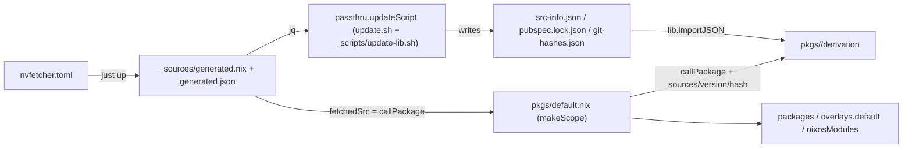

# Repository Guidelines

## Project Overview

Nix Package Collection (~45 packages) plus NixOS service modules. MIT licensed.
Distribution: flake outputs `packages`, `overlays.default`, `nixosModules.{default,daed,honk-core}`, `checks`, `devShells.default`, `formatter`; also published as NUR repo `ccicnce113424`. Binary cache: `https://ccicnce113424.cachix.org`. **x86_64-linux only** (`systems = [ "x86_64-linux" ]`).

Built with flake-parts: `flake.nix` is thin; every root `*.nix` module owns one concern (see Important Files).

## Architecture & Data Flow

Flake-parts modules imported by `flake.nix`: `treefmt.nix` (format/lint), `nixpkgs.nix` (perSystem pkgs, `allowUnfree`), `pkgs/flake-module.nix`, `modules/flake-module.nix`, `tests/flake-module.nix`, `github-actions.nix` (CI matrix).

Package aggregation: `pkgs/default.nix` is `lib.makeScope pkgs.newScope` calling every `pkgs/<dir>` with explicit source args. `pkgs/flake-module.nix` strips scope internals via `removeAttrs` → `packages`, sets `overlayAttrs = config.packages` (flake-parts `easyOverlay` → `overlays.default`), and `nixosModules.default` just applies the overlay.

Source/update data flow:



CI update loop: `update-packages.yml` (daily) spreads every update unit (each package's `passthru.updateScript`, plus nvfetcher-only sources) across a job matrix → per-unit PRs labeled `dependencies` → the Mergify merge queue rebase-merges each one against the latest main once the `All` gate passes on the combined result. `flake.lock` is kept fresh by dependabot (`nix` ecosystem); manual runs go through `Update Packages` (with a `units` filter) and `update-flake-lock.yml`. Push to main also triggers NUR update + Cachix push.

## Key Directories

| Path        | Purpose                                                                                                                                      |
| ----------- | -------------------------------------------------------------------------------------------------------------------------------------------- |
| `pkgs/`     | one directory per package; `pkgs/default.nix` aggregates; `pkgs/flake-module.nix` wires flake outputs                                        |
| `modules/`  | NixOS service modules; `modules/module-list.nix` is the keep-sorted registry                                                                 |
| `tests/`    | NixOS VM tests exposed as flake `checks`                                                                                                     |
| `_sources/` | nvfetcher output — committed but **generated; never hand-edit**                                                                              |
| `_scripts/` | updateScript runner (`run-update-scripts.sh` + `update-scripts.nix`) and `update-lib.sh`, shared bash helpers sourced by `pkgs/*/update*.sh` |
| `.github/`  | build/update workflows, `mergify.yml`, `dependabot.yml`                                                                                      |

## Development Commands

Enter dev shell first: `nix develop`, or direnv (`.envrc` = `use flake`).

| Command                                     | Purpose                                                                                                                 |
| ------------------------------------------- | ----------------------------------------------------------------------------------------------------------------------- |
| `nix build -L '.#<attr>'`                   | build one package                                                                                                       |
| `nix flake check -L`                        | full QA: eval + VM tests + treefmt check (what CI runs)                                                                 |
| `nix build -L .#checks.x86_64-linux.<name>` | run one NixOS VM test                                                                                                   |
| `just fmt` (= `nix fmt .`)                  | format + lint entire tree (treefmt)                                                                                     |
| `just up`                                   | regenerate `_sources/` from `nvfetcher.toml`                                                                            |
| `just fup`                                  | `nix flake update --commit-lock-file`                                                                                   |
| `_scripts/run-update-scripts.sh [attr …]`   | refresh update units: nvfetcher sources + `passthru.updateScript` (via nixpkgs `update.py`); `--list` prints unit names |
| `nix-build -A <pkg>` / `nix-shell`          | non-flake compat via `default.nix`/`shell.nix` (flake-compat)                                                           |

`just hello` is vestigial (bare `nix run`; no default output exists).

## Code Conventions & Common Patterns

- **Language**: code, comments, and docs in English; reply to the user in Chinese.
- **`package.nix` vs `default.nix`** (core convention):
  - `package.nix` mirrors **nixpkgs internal style** and is manually kept in sync with its nixpkgs counterpart (specific files are hand-synced). It may retain `passthru.updateScript` for nixpkgs alignment; the field is live in this repo, so re-point it (or set it to `null`) in the `default.nix` override when the repo procedure differs. Do not restyle it; keep its diff minimal for syncing.
  - `default.nix` is the **repo-native style** that fully exploits repo facilities (nvfetcher `sources`, `src-info.json`/lock JSON sidecars, `stableVersion`/`unstableVersion`). When both exist, `default.nix` is an override of `package.nix` (`callPackage ./package.nix { }` + `overrideAttrs`) re-pointing it at repo facilities (see `pkgs/open-orpheus-dev/`, `pkgs/dorion-git/`).
  - A dir with only `package.nix` is called explicitly: `self.callPackage ./kanzi-go/package.nix { }`.
- **Derivation style**: fixed-point args — `stdenv.mkDerivation (finalAttrs: { ... })`, same for `buildGoModule`, `buildRustPackage`, `buildFlutterApplication`. Reference `finalAttrs.version` in `src`; use `_final` when unused. Pair `strictDeps = true; __structuredAttrs = true;` on derivations — nixpkgs policy (required for new packages, recommended for old), so it applies to **both** `package.nix` and `default.nix`.
- **Sources come in as arguments**: packages never import `_sources/` themselves. `pkgs/default.nix` passes `sources = fetchedSrc.<name>`, `version`, `hash`, lockfile JSONs. Extra FOD hashes live in `src-info.json` (script-written) and enter via `lib.importJSON ./src-info.json`.
- **Versions**: stable = `lib.removePrefix "v" src.version` (`stableVersion` helper); tracking builds use `unstableVersion` → `"<base>-unstable-<YYYY-MM-DD>"`. Rust: `cargoDeps = rustPlatform.importCargoLock sources.cargoLock."<path>"` for nvfetcher-tracked, `cargoHash`/`vendorHash` for pinned.
- **Naming**: no suffix = stable; `-git` (branch HEAD), `-dev` (dev snapshot), `-beta` (prerelease), `-bin` (prebuilt), `-w32/-w64/-x86/-arm` (per-arch). Directory name may differ from attr name (`pkgs/open-orpheus-dev/` yields both `open-orpheus` and `open-orpheus-dev`).
- **Variants via `overrideAttrs`**, not copied derivations: arch/prerelease/tracking variants override a base derivation (see `pkgs/default.nix`, `pkgs/ntfsprogs-plus/`).
- **Meta block required**: `description` (no trailing period), `homepage`, `license`, `maintainers = with lib.maintainers; [ ccicnce113424 ];`, `mainProgram`, `platforms`; add `changelog` when upstream has one; binary packages add `sourceProvenance = with lib.sourceTypes; [ binaryNativeCode ];`.
- **keep-sorted blocks** in `pkgs/default.nix`, `modules/module-list.nix`, `tests/flake-module.nix`: insert entries alphabetically between the keep-sorted marker comments (see any of those files); the formatter enforces it.
- **Update automation**: `passthru.updateScript` is the source of truth — `_scripts/run-update-scripts.sh` runs every non-null script through the pinned nixpkgs' `maintainers/scripts/update.py` (nixpkgs contract: `command`/`attrPath`/`supportedFeatures`, `UPDATE_NIX_*` env, `nix-update-script`/`gitUpdater`/`_experimental-update-script-combinators` all supported). Simple packages use `nix-update-script { … }`; packages needing sidecar regeneration (`src-info.json`/lock JSON) point `updateScript` at their `update.sh` (`[ ./update.sh ]`, `#!/usr/bin/env -S nix shell -L nixpkgs#… -c bash`, `set -euo pipefail`, sources `_scripts/update-lib.sh`). Nvfetcher-fed packages with no extra steps declare `updateScript = null` (versions come from `just up`). **Never hand-edit** `_sources/**`, `src-info.json`, `pubspec.lock.json`, `git-hashes.json` — regenerate via `just up` / the update scripts.
- **NixOS modules** (`modules/`): options + systemd hardening + `meta.maintainers`; reference packages via `mkPackageOption pkgs "<name>"`; register in `modules/module-list.nix`; replace upstream modules with `disabledModules` (see `modules/daed.nix`).
- **GUI packages**: `makeDesktopItem` + `copyDesktopItems`, icons under `$out/share/icons/hicolor/<size>/apps/`, `wrapProgram` for `LD_LIBRARY_PATH` / Electron `--add-flags "\${NIXOS_OZONE_WL:+...}"`.
- **Shell scripts**: shfmt + shellcheck enforced by treefmt (`source-path = "SCRIPTDIR"`); match the existing `update.sh` style.

### Adding a package

1. Create `pkgs/<name>/` (copy a neighbor: simple → `lxgw-wenkai-gb`, Rust/Tauri → `dorion-git`, binary → `waywallen-bin`, Go → `kanzi-go`, CMake → `kanzi-cpp`, Flutter → `piliplus`, stable+dev split → `open-orpheus-dev`). Use `package.nix` for the nixpkgs-aligned base (syncable with nixpkgs) and `default.nix` for the repo-native override; a single `default.nix` is fine for repo-only packages.
2. Add a keep-sorted entry in `pkgs/default.nix`: `foo = self.callPackage ./foo { sources = fetchedSrc.foo; ... };`.
3. Track sources in `nvfetcher.toml` (`src.github` / `src.git` / `fetch.url`; `cargo_lock`/`extract` for lockfiles) and run `just up`.
4. Declare `passthru.updateScript` (`nix-update-script { … }` for plain bumps, `[ ./update.sh ]` for sidecar regeneration); the `update-packages.yml` matrix picks it up automatically.
5. `just fmt`, then `nix flake check -L`.

## Important Files

| File                                                            | Role                                                                                              |
| --------------------------------------------------------------- | ------------------------------------------------------------------------------------------------- |
| `flake.nix`                                                     | flake-parts entry: inputs, `systems`, devShell, `nixConfig` (substituters, experimental features) |
| `pkgs/default.nix`                                              | the package set: `makeScope`, `stableVersion`/`unstableVersion`, all `callPackage` wiring         |
| `pkgs/flake-module.nix`                                         | scope → `packages`, `overlays.default`, `nixosModules.default`                                    |
| `modules/module-list.nix`                                       | NixOS module registry (keep-sorted)                                                               |
| `tests/flake-module.nix`                                        | registers VM tests as `checks`                                                                    |
| `nvfetcher.toml`                                                | source-pinning config (34 sources)                                                                |
| `_sources/generated.nix`                                        | generated source set — DO NOT EDIT                                                                |
| `_scripts/run-update-scripts.sh`, `_scripts/update-scripts.nix` | updateScript runner (CI daily job) + `packages.json` generator                                    |
| `_scripts/update-lib.sh`                                        | shared helpers for `pkgs/*/update*.sh`                                                            |
| `treefmt.nix`                                                   | formatter/linter config (excludes `*_sources/*`)                                                  |
| `github-actions.nix`                                            | CI build matrix over `self.packages` minus `meta.broken`                                          |
| `justfile`, `.envrc`, `devshell.nix`                            | command surface, direnv, dev tools                                                                |
| `default.nix`, `shell.nix`                                      | flake-compat shims for `nix-build`/`nix-shell`                                                    |

## Runtime/Tooling Preferences

- **Nix with flakes** required (`nix-command flakes`, `accept-flake-config`); `flake.lock` is format v7 → recent Nix or Lix. Non-flake entry works via Lix flake-compat.
- Caches: `ccicnce113424.cachix.org`, `nix-community.cachix.org` (declared in `flake.nix` `nixConfig`).
- Dev shell: `just`, `nixd`, `just-lsp`, `nix-prefetch-git`, `nvfetcher-bin`. Scripts additionally use `jq`, `yq`, `nix-update` (pulled ad hoc via `nix shell`).
- No pre-commit hooks — run `just fmt` manually before committing; `nix flake check` re-verifies formatting.
- VCS: **Jujutsu** (`.jj/`) locally; Git/GitHub is the canonical remote/CI interface. Use `jj` (with `--no-pager`, always `-m`); never mutating raw `git`.
- `result*`, `.direnv/`, `.vscode/` are gitignored; everything else (including `_sources/`) is committed.

## Testing & QA

Mechanism: **NixOS VM tests** (`pkgs.testers.runNixOSTest`) exposed as flake `checks`. Name convention: package == module == test file == check attr (`daed`, `honk-core`). No unit/smoke-test tier exists.

```nix
# tests/flake-module.nix — registration pattern (keep-sorted block)
daed = pkgs.testers.runNixOSTest {
  imports = [ ./daed.nix ];
  extraBaseModules = { imports = [ self.nixosModules.daed ]; };
  defaults.services.daed.package = self'.packages.daed;
};
```

- Test file shape (`tests/daed.nix`): `{ lib, ... }: { name; meta.maintainers; nodes.<n> = { services.<name>.enable = true; ... }; testScript = '' ... ''; }` — Python driver DSL asserting service behavior (`wait_for_unit`, `wait_for_open_port`, `machine.succeed "curl ..."`), not versions/file lists.
- Run: all = `nix flake check -L` (also evaluates the flake and runs the treefmt check); single = `nix build -L .#checks.x86_64-linux.<name>`. VM tests need KVM/QEMU.
- New tests are for packages that ship a NixOS module: add `tests/<name>.nix` + keep-sorted entry above.
- Coverage: only `daed` and `honk-core` have tests; everything else is verified solely by the CI build matrix (`nix build` of every non-broken package). CI gate job is `All` (`build.yml`).
- Caveat: `passthru.tests` in `pkgs/daed/package.nix` points at nixpkgs' `nixosTests.daed`, which does not exist in the pinned nixpkgs — the repo's `checks.daed` is the authoritative wiring.
