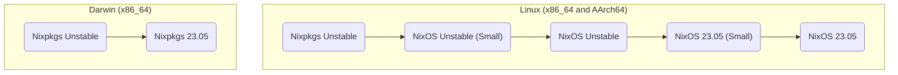

# NUR Packages

My personal [NUR](https://github.com/nix-community/NUR) repository.

## Cache

This repository uses GitHub Actions to build and push all packages to a cache
provided by Cachix and is currently available for the following platforms:

