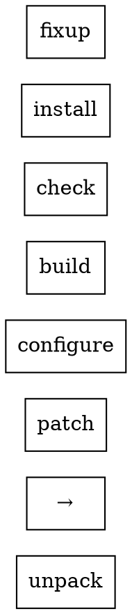

## Build Phases and Hooks

Nix derivations run through 7 standard phases. You can customize any phase with hooks.

## The 7 Standard Phases



1. **unpack** - Extract source files
2. **patch** - Apply patches and modifications
3. **configure** - Prepare for building (./configure, cmake, etc.)
4. **build** - Compile/build (make, ninja, etc.)
5. **check** - Run tests
6. **install** - Copy files to $out
7. **fixup** - Final fixes (strip binaries, fixup rpaths, etc.)

## Hooks for Each Phase

Each phase has `pre` and `post` hooks:

```nix
stdenv.mkDerivation {
  # Before unpacking
  preUnpack = ''
    echo "About to extract $src"
  '';

  # After unpacking
  postUnpack = ''
    echo "Extracted to $sourceRoot"
  '';

  # Before patching
  prePatch = ''
    echo "About to patch source"
  '';

  # After patching
  postPatch = ''
    echo "Patching complete"
    # Fix hardcoded paths
    substituteInPlace Makefile \
      --replace "/usr/bin" "$out/bin"
  '';

  # Before configure
  preConfigure = ''
    echo "Configuring build"
  '';

  # After configure
  postConfigure = ''
    echo "Build configured"
  '';

  # Before build
  preBuild = ''
    echo "Building..."
  '';

  # After build
  postBuild = ''
    echo "Build complete"
  '';

  # Before install
  preInstall = ''
    mkdir -p $out/bin
  '';

  # After install
  postInstall = ''
    echo "Installed to $out"
  '';

  # Before fixup
  preFixup = ''
    echo "About to fixup"
  '';

  # After fixup
  postFixup = ''
    echo "Fixup complete"
  '';
}
```

## Common Binary Package Hooks

For binary packages, you typically only need `unpackPhase` and `installPhase`:

```nix
stdenv.mkDerivation {
  pname = "myapp";
  version = "1.0.0";
  src = ./myapp-${version}.tar.gz;

  nativeBuildInputs = [ pkgs.autoPatchelfHook ];

  buildInputs = [ pkgs.glib pkgs.gtk3 ];

  # Custom unpack (not needed for .tar.gz, but shown for completeness)
  unpackPhase = ''
    tar xf $src
  '';

  # Skip configure and build (binary package)
  configurePhase = ''
    echo "No configure needed for binary package"
  '';

  buildPhase = ''
    echo "No build needed for binary package"
  '';

  # Install the binary
  installPhase = ''
    mkdir -p $out/bin
    cp myapp $out/bin/myapp
  '';

  # No check phase for binaries
  doCheck = false;
}
```

## Skipping Phases

You can disable entire phases:

```nix
stdenv.mkDerivation {
  # Skip configure
  configurePhase = "true";

  # Skip build
  buildPhase = "true";

  # Skip check
  doCheck = false;

  # Skip install (rare)
  installPhase = "true";
}
```

## Custom Phases

Replace entire phase:

```nix
stdenv.mkDerivation {
  # Replace unpackPhase entirely
  unpackPhase = ''
    echo "Custom unpacking"
    ar x $src  # For .deb
    tar xf data.tar.xz
  '';

  # Replace installPhase entirely
  installPhase = ''
    echo "Custom installation"
    mkdir -p $out/opt/myapp
    cp -r myapp/* $out/opt/myapp/

    mkdir -p $out/bin
    ln -s $out/opt/myapp/myapp $out/bin/myapp
  '';
}
```

## Phase Variables

These variables are available during build:

| Variable | Description |
|----------|-------------|
| `$src` | Source file path |
| `$sourceRoot` | Root of extracted source |
| `$out` | Installation output path |
| `$PWD` | Current working directory in build |
| `$TMPDIR` | Temporary directory |
| `$TMP` | Temporary directory |
| `$TEMP` | Temporary directory |
| `$TEMPDIR` | Temporary directory |

## Common postInstall Tasks

```nix
postInstall = ''
  # Create wrapper script
  makeWrapper $out/opt/myapp/myapp $out/bin/myapp \
    --prefix PATH : "${lib.makeBinPath [ ffmpeg ]}" \
    --set MY_VAR "value"

  # Fix desktop file paths
  substituteInPlace $out/share/applications/myapp.desktop \
    --replace "/opt/myapp" "$out/opt/myapp"

  # Copy documentation
  mkdir -p $out/share/doc
  cp README.md $out/share/doc/

  # Write version file
  echo "${version}" > $out/share/VERSION
'';
```

## Common postPatch Tasks

```nix
postPatch = ''
  # Fix hardcoded paths
  substituteInPlace src/config.txt \
    --replace "/usr/local" "$out"

  # Fix shebangs
  patchShebangs scripts/*.sh

  # Make scripts executable
  chmod +x scripts/*.sh
'';
```

## Debugging Phases

Add debugging output:

```nix
stdenv.mkDerivation {
  # See what's in $PWD after unpack
  postUnpack = ''
    echo "Contents of $sourceRoot:"
    ls -R $sourceRoot
  '';

  # See what gets installed
  postInstall = ''
    echo "Installed files:"
    find $out -type f
  '';
}
```

## Complete Binary Package Example

```nix
{ pkgs }:

pkgs.stdenv.mkDerivation rec {
  pname = "myapp";
  version = "1.0.0";
  src = ./myapp-${version}.deb;

  nativeBuildInputs = with pkgs; [
    autoPatchelfHook
    dpkg
    makeWrapper
  ];

  buildInputs = with pkgs; [
    stdenv.cc.cc.lib
    glib
    gtk3
  ];

  # Unpack .deb
  unpackPhase = ''
    ar x $src
    tar xf data.tar.xz
  '';

  # No configure needed
  configurePhase = "true";

  # No build needed
  buildPhase = "true";

  # Install binary
  installPhase = ''
    mkdir -p $out
    cp -r opt/* $out/

    # Fix desktop file
    if [ -f usr/share/applications/myapp.desktop ]; then
      mkdir -p $out/share/applications
      cp usr/share/applications/myapp.desktop $out/share/applications/
      substituteInPlace $out/share/applications/myapp.desktop \
        --replace "/opt/myapp" "$out"
    fi
  '';

  # Wrap binary after install
  postInstall = ''
    makeWrapper $out/myapp/bin/myapp $out/bin/myapp \
      --add-flags "--disable-gpu-sandbox"
  '';

  # No tests
  doCheck = false;
}
```

## Phase Hook Quick Reference

| Hook | When | Common Use |
|------|------|------------|
| `preUnpack` | Before extraction | Verification |
| `postUnpack` | After extraction | Check contents |
| `prePatch` | Before patching | Prepare for patches |
| `postPatch` | After patching | Fix paths, patch files |
| `preConfigure` | Before configure | Set env vars |
| `postConfigure` | After configure | Verify config |
| `preBuild` | Before build | Set build flags |
| `postBuild` | After build | Verify build |
| `preInstall` | Before install | Create dirs |
| `postInstall` | After install | Wrap, fix paths |
| `preFixup` | Before fixup | Prepare for fixup |
| `postFixup` | After fixup | Final touches |

## Further Reading

- [Nixpkgs Manual - Phases](https://nixos.org/manual/nixpkgs/stable/#sec-building-derivations)
- See [wrapper-programs](wrapper-programs.md) for makeWrapper usage
