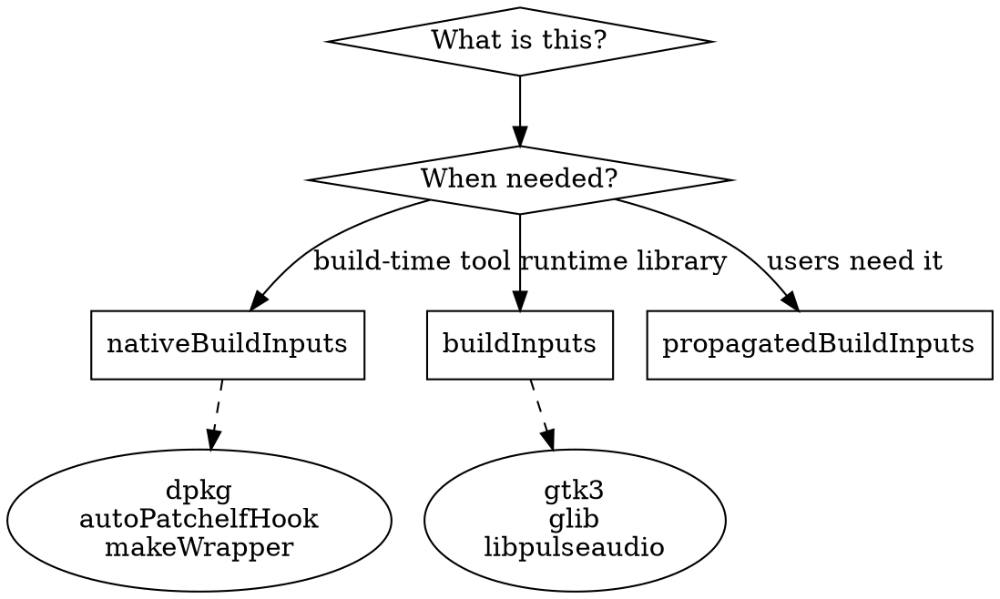

## The Three Dependency Categories

Nix has three types of dependencies. Understanding which to use is critical.



## nativeBuildInputs

**Tools needed during the build process only.**

These tools are executed to extract, patch, or install the package, but aren't needed at runtime.

```nix
nativeBuildInputs = with pkgs; [
  autoPatchelfHook  # Fixes library paths in binaries
  dpkg              # Extracts .deb files
  rpm               # Extracts .rpm files
  cpio              # Works with rpm for extraction
  unzip             # Extracts .zip files
  makeWrapper       # Creates wrapper scripts
  substitute        # Patches hardcoded paths
];

# These are NOT available at runtime
# They're only available during the build
```

## buildInputs

**Libraries the application links against at runtime.**

These are the actual shared libraries (.so files) that the binary needs to run.

```nix
buildInputs = with pkgs; [
  # C standard library
  stdenv.cc.cc.lib

  # GTK/GUI libraries
  glib
  gtk3
  gdk-pixbuf
  cairo
  pango

  # Audio
  libpulseaudio
  alsa-lib

  # X11/Wayland
  xorg.libX11
  xorg.libXcomposite
  xorg.libXdamage
  libxkbcommon

  # Other common libs
  mesa
  libdrm
  dbus
  nss
  nspr
];

# These libraries ARE available at runtime
# autoPatchelfHook adds them to the binary's rpath
```

## propagatedBuildInputs

**Dependencies that users of your package also need.**

Rarely used for binary packaging. Only use when other packages depending on your package need these libraries too.

## Incorrect

```nix
# ❌ Wrong: Libraries in nativeBuildInputs
nativeBuildInputs = with pkgs; [
  autoPatchelfHook
  gtk3    # ← This is wrong! gtk3 is a runtime library
  glib    # ← Wrong!
];

# ❌ Usually NOT needed for binary packages
propagatedBuildInputs = [ pkgs.someLib ];
```

## Correct

```nix
# ✅ Correct: Libraries in buildInputs
nativeBuildInputs = with pkgs; [
  autoPatchelfHook
];

buildInputs = with pkgs; [
  gtk3    # ← Correct! Runtime library
  glib    # ← Correct!
];
```

## Dependency Category Quick Reference

| Package Type | Category | Why |
|--------------|----------|-----|
| `autoPatchelfHook` | nativeBuildInputs | Build tool, patches binaries |
| `dpkg` | nativeBuildInputs | Extracts .deb during build |
| `makeWrapper` | nativeBuildInputs | Creates wrapper scripts |
| `gtk3` | buildInputs | Binary links against it at runtime |
| `glib` | buildInputs | Runtime library |
| `stdenv.cc.cc.lib` | buildInputs | C standard library, runtime |
| `mesa` | buildInputs | OpenGL runtime library |
| `libpulseaudio` | buildInputs | Audio runtime library |

## How to Find Dependencies

```bash
# After building, check what's missing
ldd result/bin/myapp | grep "not found"

# Common missing libraries:
# libgtk-3.so.0   → gtk3
# libglib-2.0.so.0 → glib
# libpulse.so.0    → libpulseaudio
# libGL.so.1       → mesa or libglvnd
# libxkbcommon.so.0 → libxkbcommon (NOT xorg.libxkbcommon)
```

See [finding-libraries](finding-libraries.md) for detailed guide.
