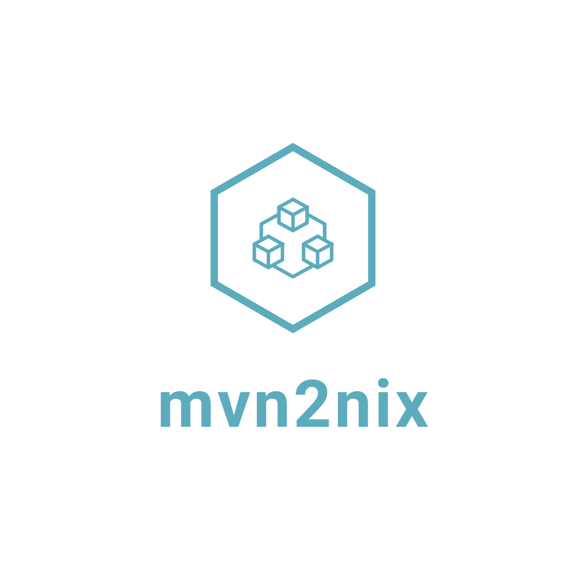

<p align="center">
  
</p>


[](https://builtwithnix.org)

> Easily package your Maven Java application with the Nix package manager.

<!--ts-->
* [How to use this](#how-to-use-this)
   * [Generating the Nix dependencies file](#generating-the-nix-dependencies-file)
   * [Building a Maven repository](#building-a-maven-repository)
   * [Sample Derivation](#sample-derivation)
* [How does it work?](#how-does-it-work)
* [Development](#development)
<!-- Added by: fmzakari, at: Mon Aug 24 21:40:20 PDT 2020 -->
<!--te-->

__:warning: mvn2nix is in active development but is ready to be used. Please pin it to a commit to avoid
any flux.__

## How to use this

```bash
# non-flake
$ nix run -f https://github.com/fzakaria/mvn2nix/archive/master.tar.gz --command mvn2nix

# flake
$ nix run github:fzakaria/mvn2nix#mvn2nix
```

If you have [cachix](https://cachix.org/) installed, you can leverage our prebuilt binary.
> cachix use fzakaria

### Generating the Nix dependencies file

In the same spirit of [bundix](https://github.com/nix-community/bundix), **mvn2nix** creates a Nix set with the
*transitive closure* of all dependencies required by the application.

```bash
# non-flake usage
$ nix run -f https://github.com/fzakaria/mvn2nix/archive/master.tar.gz \
        --command mvn2nix > mvn2nix-lock.json

# flake usage
$ nix run github:fzakaria/mvn2nix#mvn2nix > mvn2nix-lock.json

$ head mvn2nix-lock.json
{
  "dependencies": {
    "org.junit.jupiter:junit-jupiter:jar:5.6.2": {
      "layout": "org/junit/jupiter/junit-jupiter/5.6.2/junit-jupiter-5.6.2.jar",
      "sha256": "dfc0d870dec4c5428a126ddaaa987bdaf8026cc27270929c9f26d52f3030ac61",
      "url": "https://repo.maven.apache.org/maven2/org/junit/jupiter/junit-jupiter/5.6.2/junit-jupiter-5.6.2.jar"
    },
    "org.codehaus.plexus:plexus-utils:pom:3.0.15": {
      "layout": "org/codehaus/plexus/plexus-utils/3.0.15/plexus-utils-3.0.15.pom",
      "sha256": "b4fe0bed469e2e973c661b4b7647db374afee7bda513560e96cd780132308f0b",
      "url": "https://repo.maven.apache.org/maven2/org/codehaus/plexus/plexus-utils/3.0.15/plexus-utils-3.0.15.pom"
    },
```

You can then use this to download all the necessary dependencies to run your application.

### Building a Maven repository

Now that you have a **nix** dependencies file; we can re-construct a Maven repository using Nix!

```nix
let mvn2nix = import (fetchTarball https://github.com/fzakaria/mvn2nix/archive/master.tar.gz) { };
in
mvn2nix.buildMavenRepositoryFromLockFile { file = ./mvn2nix-lock.json; }
```

This creates a **/nix/store** path which is a Maven repository that can be used, such as in `mvn package --offline -Dmaven.repo.local=${mavenRepository}`

```bash
$ tree /nix/store/0ylsqi62jqz5gqf0dqrz5a3hj3jrzrwx-mvn2nix-repository | head

/nix/store/0ylsqi62jqz5gqf0dqrz5a3hj3jrzrwx-mvn2nix-repository
├── com
│   └── google
│       ├── code
│       │   └── findbugs
│       │       └── jsr305
│       │           └── 3.0.2
│       │               └── jsr305-3.0.2.jar -> /nix/store/w20lb1dk730v77qis8l6sjqpljwkyql7-jsr305-3.0.2.jar
│       ├── errorprone
│       │   └── error_prone_annotations
```

### Sample Derivation

```nix
{ pkgs ? import <nixpkgs> {} }:
let
  mvn2nix = import
    (fetchTarball "https://github.com/fzakaria/mvn2nix/archive/master.tar.gz")
    { };
  mavenRepository =
   mvn2nix.buildMavenRepositoryFromLockFile { file = ./mvn2nix-lock.json; };
inherit (pkgs) lib stdenv jdk11_headless maven makeWrapper;
inherit (stdenv) mkDerivation;
in mkDerivation rec {
  pname = "my-artifact";
  version = "0.01";
  name = "${pname}-${version}";
  src = lib.cleanSource ./.;

  nativeBuildInputs = [ jdk11_headless maven makeWrapper ];
  buildPhase = ''
    echo "Building with maven repository ${mavenRepository}"
    mvn package --offline -Dmaven.repo.local=${mavenRepository}
  '';

  installPhase = ''
    # create the bin directory
    mkdir -p $out/bin

    # create a symbolic link for the lib directory
    ln -s ${mavenRepository} $out/lib

    # copy out the JAR
    # Maven already setup the classpath to use m2 repository layout
    # with the prefix of lib/
    cp target/${name}.jar $out/

    # create a wrapper that will automatically set the classpath
    # this should be the paths from the dependency derivation
    makeWrapper ${jdk11_headless}/bin/java $out/bin/${pname} \
          --add-flags "-jar $out/${name}.jar"
  '';
}
```

### Example flake usage

```nix
# flake.nix
{
  inputs = {
    mvn2nix.url = "github:fzakaria/mvn2nix";
    utils.url = "github:numtide/flake-utils";
  };

  outputs = { nixpkgs, mvn2nix, utils, ... }:
  let
    pkgsForSystem = system: import nixpkgs {
      # ./overlay.nix contains the logic to package local repository
      overlays = [ mvn2nix.overlay (import ./overlay.nix) ];
      inherit system;
    };
  in utils.lib.eachSystem utils.lib.defaultSystems (system: rec {
    legacyPackages = pkgsForSystem system;
    packages = utils.lib.flattenTree {
      inherit (legacyPackages) myMavenProject;
    };
    defaultPackage = legacyPackages.myMavenProject;
  });
}
```

```nix
# overlay.nix
final: prev: {
  myMavenProject = final.callPackage ./myPackage.nix { };
}
```

```nix
# myPackge.nix
{ lib, stdenv, buildMavenRepositoryFromLockFile
, makeWrapper, maven, jdk11_headless
, nix-gitignore
}:


let
  mavenRepository = buildMavenRepositoryFromLockFile { file = ./mvn2nix-lock.json; };
in stdenv.mkDerivation rec {
  pname = "myMavenProject";
  version = "0.9.3";
  name = "${pname}-${version}";
  src = nix-gitignore.gitignoreSource [ "*.nix" ] ./.;

  nativeBuildInputs = [ jdk11_headless maven makeWrapper ];
  buildPhase = ''
    echo "Building with maven repository ${mavenRepository}"
    mvn package --offline -Dmaven.repo.local=${mavenRepository}
  '';

  installPhase = ''
    # create the bin directory
    mkdir -p $out/bin

    # create a symbolic link for the lib directory
    ln -s ${mavenRepository} $out/lib

    # copy out the JAR
    # Maven already setup the classpath to use m2 repository layout
    # with the prefix of lib/
    cp target/${name}.jar $out/

    # create a wrapper that will automatically set the classpath
    # this should be the paths from the dependency derivation
    makeWrapper ${jdk11_headless}/bin/java $out/bin/${pname} \
          --add-flags "-jar $out/${name}.jar"
  '';
}
```

## How does it work?

**mvn2nix** relies on [maven-invoker](https://maven.apache.org/shared/maven-invoker/); which fires off
Maven in a separate JVM process.

Maven is executed with a temporary *ephemeral* local repository for the given goals provided (defaults to **package**).
The local repository is than traversed, and each encountered file is recorded in the dependencies list.

**mvn2nix** includes an [example](examples/mvn2nix/default.nix) output & derivation that builds itself!

## Development

If you are running *mvn2nix* from this repository, you can do so with **nix-build**

```bash
$ nix-build

./result/bin/mvn2nix > example/mvn2nix-lock.json
```

If you want to test **buildMavenRepository** you can run:
```bash
$ nix-build -A buildMavenRepositoryFromLockFile --arg file "./mvn2nix-lock.json"
```

At the moment, _mvn2nix_ is **self-bootstrapped** consuming it's own _mvn2nix-lock.json_.
If for whatever reason, the JSON format changes or you need to update the dependencies, you can run _mvn2nix-bootstrap_.

```bash
$ nix-build -A mvn2nix-bootstrap

./result/bin/mvn2nix > example/mvn2nix-lock.json
```
