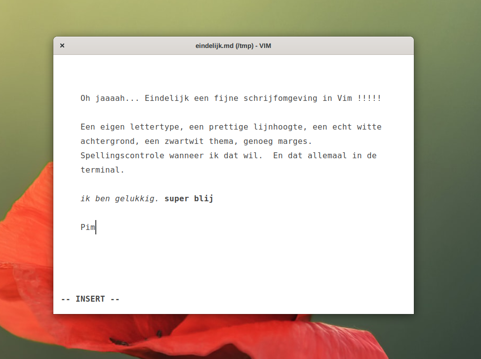

# Nixos for Pim's machine park

This is my mono-repository for my machines configuration and my dotfiles.

## MacOS Provisioning

For macOS provisioning I only use Home-Manager from Nix. Cli tools are declared
in home-pim/programs/macos-bundle.nix. Other mac-apps are in
home-pim/files-macos/Brewfile. Install them with `brew bundle install`

## Linux Desktop Highlights

I use GNOME as desktop environment with a few extensions to give me some
features I'm used too from the time I used macOS as primary OS.

### Programming and writing

I payed a lot of time optimizing my terminal and vim configuration. I use
[St](https://st.suckless.org) with a few patches for better aesthetics.

My St/Vim writing configuration has a larger line height, a dedicated font, a
pure white background together with a grayscale writing theme. Here's a pic
showing my writing environment.

### TODO

unstable packages
comma package
billquick
darwin confs
vm ware confs
minimal homemanager conf

